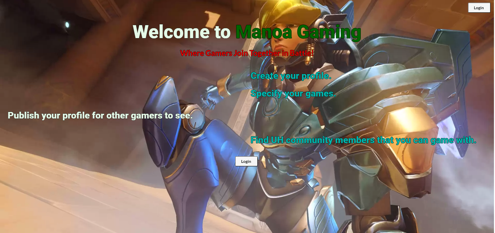

Using Meteor to build an application/website while coding in Javascript for functionality and CSS for customizing the look of the application. Another thing that was implemented to customizing the look of the application was Semantic UI.

<a href="http://manoagaming1.meteorapp.com/"><i class="large meteor icon"></i>Link to Website</a>

Source: <a href="https://manoagaming.github.io/"><i class="large github icon"></i>ProjectSource</a>
